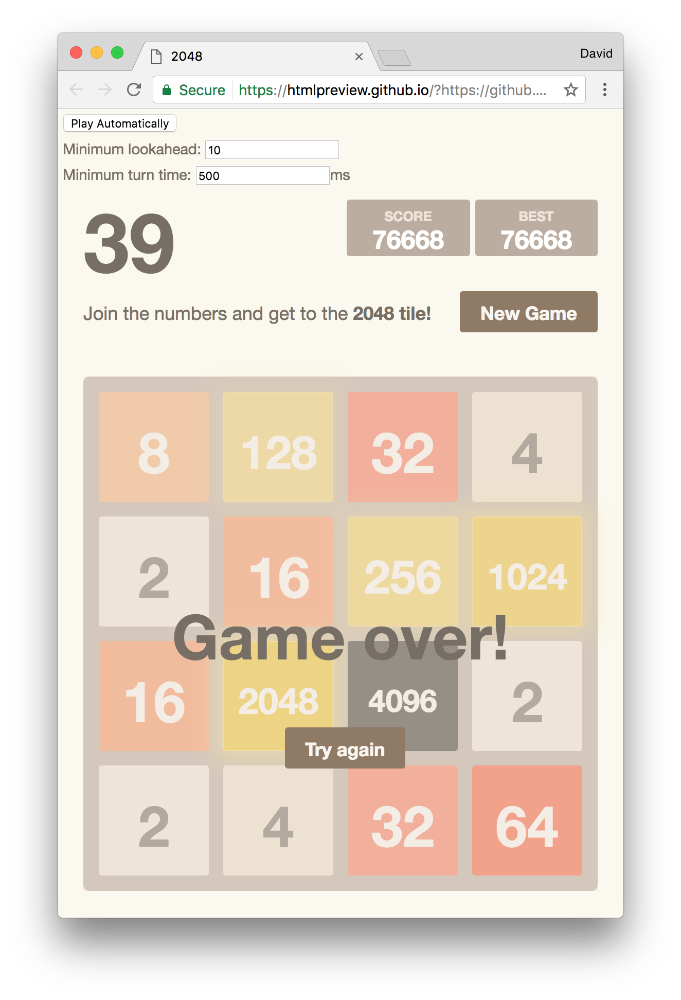

# OptimisationStuff

## 2048 AI

http://davidje13.github.io/OptimisationStuff/2048AI.htm

This plays an automated game of 2048.

It loads an old snapshot of the 2048 game and add a "Play Automatically" button to the top-left. Click this button to watch it play.

## Ants

http://davidje13.github.io/OptimisationStuff/ants.htm

Simulates an ant colony finding random sources of food. Click & drag to add walls, and right-click to erase the walls. The ant nest is in the centre and food is placed at random.

## Lights

http://davidje13.github.io/OptimisationStuff/lights.htm

Solves the best position to place lights in a rectangular room for best lighting by brute-force. No runtime configurable values are available.

## Dice

http://davidje13.github.io/OptimisationStuff/dice.htm

Solves which dice to use and threshold to set to achieve a particular probability.
